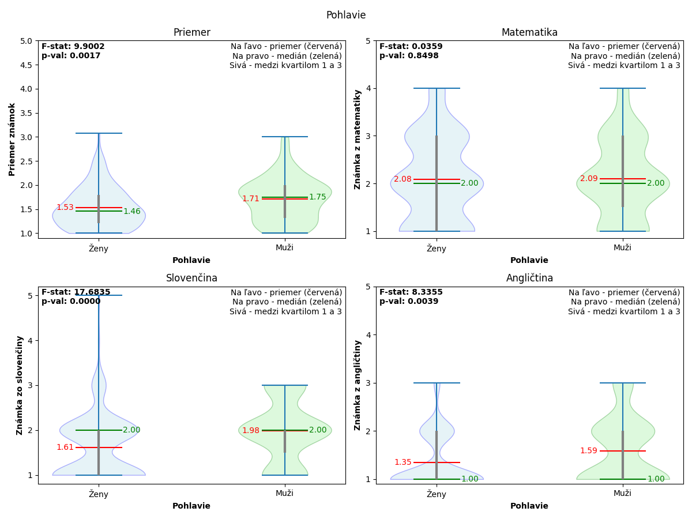

# Hello!

Welcome to the technical repository for my 2024/2025 SOC paper,
this is where I keep all my scripts, scientific tests, algorithms, and graphing programs,
let me walk you through how it works, I've split it into multiple sections:

1. [Tools and libraries](#tools-and-libraries)
2. [Dataset](#dataset)
3. [Distribution](#distribution)
4. [Analysis and scientific tests](#analysis-and-scientific-tests)
5. [Graphing](#graphing)
6. [Neural network](#neural-network)

Don't forget to check out the [conclusion](#conclusion) and the [credits](CREDITS.md)

### Tools and libraries

Basically all scripts are written in [python](https://www.python.org/), except for one shell script, and these are the
libraries that were used: 

- [numpy](https://numpy.org/) - to load and manipulate the data
- [pandas](https://pandas.pydata.org/) - to construct tables
- [scipy](https://scipy.org/) - to perform statistical tests
- [matplotlib](https://matplotlib.org/) - to create and render graphs
- [pytorch](https://pytorch.org/) - to model and train the neural network

Google Forms provides the data as a `.csv` file, which is converted into a `.npy` (numpy) file

### Dataset

The documentation for the dataset structure can be found in [DATASET.md](DATASET.md),
this is only interesting for the nerds

### Distribution

This is probably the easiest part of this whole thing, it's basically just making charts and computing percentages,
say you have 12 male and 15 female respondents, what is the distribution? It's quite simple, here:

`(number of elements in a group) / (number of elements in the dataset)`

So in this case, the distribution of male respondents would be `(12) / (12 + 15) = ~44%`, and female `(15) / (12 + 15) = ~56%`,
now that we know this, we can make a pretty pie graph! The script that does all of this is [distribution.py](distribution.py)

### Analysis and scientific tests

This is where stuff gets interesting, the script that does all the heavy lifting is [analyze.py](analyze.py),
then, you have the specified analysis scripts, like [analyze_sex.py](analyze_sex.py)
(which, surprisingly, only analyzes sex)

[analyze_sex.py](analyze_sex.py) only picks out its data from the dataset and passes it down to [analyze.py](analyze.py) to do all the analyses, where the following things happen:

1. the received data is put into groups, each receiving an assigned letter (A, B, C, etc), groups of insufficient size are removed
2. if there are less than 2 groups, analysis aborts
3. [Kruskal-Wallis test](https://en.wikipedia.org/wiki/Kruskal%E2%80%93Wallis_test) is performed and `F` and `p` values are received
4. if `p` is greater than 0.05, the difference between those groups is not statistically significant and analysis aborts
5. post-hoc [Dunn test](https://www.statology.org/dunns-test/) is performed and `p` values are saved
6. a result table is created, a comparison between each group is added as well as their [rank-biserial correlation](https://www.statisticshowto.com/rank-biserial-correlation/), difference in medians, difference in means, and post-hoc `p` value

Problem solved!
If the difference is statistically insignificant,
or we don't have sufficient data to perform a statistical test, the analysis aborts,
otherwise, we get our `F` value, `p` value, and the result table, which could look something like this:

| Skupina 1 | Skupina 2 | Veľkosť účinku | Rozdiel priemerov | Rozdiel mediánov | Post-Hoc p-hodnota |
|-----------|-----------|----------------|-------------------|------------------|--------------------|
| A         | B         | 0.0440         | 0.4198            | 0.0000           | 0.0497             |
| A         | C         | 0.0399         | 0.2723            | 0.0000           | 0.5239             |
| B         | C         | -0.0084        | -0.1475           | 0.0000           | 0.3706             |

### Graphing

Once the analysis is complete, successful or not, we can graph the data, we mostly use violin plots,
which are quite easy to understand and interpret, it goes like this:

1. the window is split into four subplots, top left for average grade, top right for math grade, bottom left for slovak grade, and bottom right for english grade
2. all groups get added to each subplot as a violin plot, so for sex, each subplot would contain a violin plot for males and a violin plot for females
3. the `F` and `p` values get added to the top left corner of each subplot
4. the legend gets added to the top right corner of each subplot and axes are marked
5. each violin plot contains five pieces of valuable information:
   1. the shaded background that shows the distribution of the data
   2. the gray line that represents the data between the first and third quartile
   3. the red mean line with the mean value on the left
   4. the green median line with the median value on the right
   5. the minimum and maximum bounds
6. labels get added to each violin plot

Quite complicated, right? A ton of data packed into one small image, which could look something like this:

It can be overwhelming to look at at first, but once you understand what's going on, it's quite intuitive, anyway,
the function that does all this is also saved in [analyze.py](analyze.py)

All the graphs are saved in the archives, which you can download, [results.tar.gz](results.tar.gz) and [results.zip](results.zip)

### Neural network

Ah!
AI stuff!
Well, it didn't work in the end because of the abysmal amount of data, but the structure and
the training process is still here and can be looked at

The script that trains the neural network is [train_nn.py](train_nn.py) (yes, I am very creative when it comes to
naming stuff, I am aware), it uses the [pytorch](https://pytorch.org/) library to do all the math stuff that goes on
behind the scenes, but the important part is the structure of the neural network, right here:

Of course, we have to use the `.npy` file format to load the data into our program, so how do we convert the `.csv`
data provided by the Google Forms into a `.npy`?
The answer lies in [clean.py](clean.py), but I'm not going to go
into how it all works, since the script just cleans the data

The whole training thing is pretty complicated, so if you don't know anything about neural networks, just forget about
it and attribute it to magic, but if you do, read through [train_nn.py](train_nn.py),
it's a pretty clean and readable code

## Conclusion

Hopefully you learned something when you read through this README or the various scripts, because that's the main
reason why I decided to make this repository public, so folks can look at this and learn new stuff

I had a lot of fun on this project, gathering data, writing scripts, conducting scientific tests, and writing the paper,
it was an unforgettable experience, and even though it was really hard, it was definitely worth it and I would
definitely do it again, and I recommend you try this sort of thing as well

If you have read this whole README till the end, I thank you, because it took a Saturday afternoon to write that I
could've spent playing video games, but it was worth it as long as at least one person took a quick glance at it

If you have any questions about the paper, this repository, the technical details and the specific techniques, or even
if you're thinking about writing a paper yourself, feel free to reach out to me at
[daniel@svitan.dev](mailto:daniel@svitan.dev) or send me a message on discord (Streamer272), I will gladly answer
any questions and talk about this project for hours

### License

This project is licensed under the [MIT License](LICENSE)
